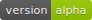
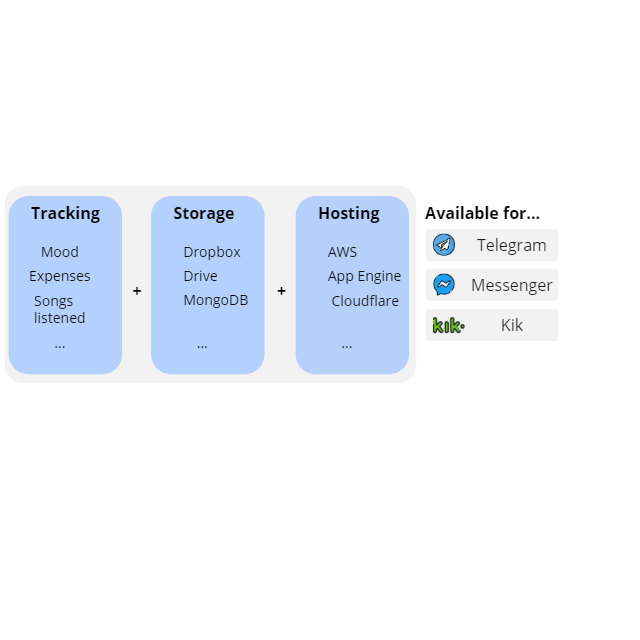

# Observer Bot 

*Record your data anywhere, anytime. Store it where you want it, use it however you like it*.

## About

The goal of ObserverBot is concise: *to allow anyone to record, store and process its own data the way he/she wants, in a way that is free and hustle-free*.

To achieve this goal, the framework is built on top of a decoupled infrastructure, which heavily relies on chat bots:

Furthermore, these bots focus on the use of free cloud storage (such as Dropbox or Google Drive) and free hosting as well (serverless/lambda instance on AWS / Google App Engine / Azure)

## Bots

As of today, everything is ran on Python 3.6. Three external libraries are used:

+ [python-telegram-bot](https://github.com/python-telegram-bot/python-telegram-bot)
+ [Dropbox’s SDK](https://github.com/dropbox/dropbox-sdk-python/)
+ [serverless](https://github.com/serverless/serverless) (which uses NodeJS)

## Timeline

#### Near-term goals

* Deploy a set of tracker bots under `bots/`, such as `moodtracker` or `expensestracker`
* Make available at least 2 storage providers, such as Dropbox or MongoDB
* Release a simple API to create new trackers, which shall consist of three simple methods: `Setup`, `addObservation` and `Sync`.

#### Long-term goals

* Open the API for more languages (currently focusing on Python, as it’s the [most popular language](https://github.com/topics/telegram))

---

Icons made by <a href="https://www.freepik.com/" title="Freepik">Freepik</a> from <a href="https://www.flaticon.com/" 			    title="Flaticon">www.flaticon.com</a> is licensed by <a href="http://creativecommons.org/licenses/by/3.0/" 			    title="Creative Commons BY 3.0" target="_blank">CC 3.0 BY</a>

